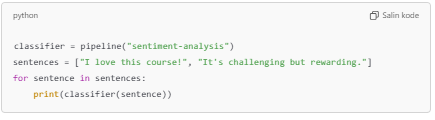

<h1 align="center"> NLP Dengan Huggingface Transforer </h1>

 Jupyter Notebook untuk mempelajari tentang regresi, klasifikasi dan clustering

### Regresi
- Linear Regression
- Ridge 
- Lasso
- ElasticNet

### Klasifikasi
- Logistic Regression
- K-Nearest Neighbors
- Support Vector Machine (SVM)

### Clustering
- K-Means Clustering
- Agglomerative Clustering
- DBSCAN (Density-based Spatial Clustering of Application with Noise)

Analisis Pipeline 🔍

1. Zero-Shot Classification

Analisis:
Zero-Shot Classification sangat menarik karena fleksibilitasnya. Model tidak memerlukan data berlabel dan mampu memberikan probabilitas kecocokan untuk beberapa kategori. Di sini, teks berhasil diklasifikasikan dengan label "technology" sebagai hasil tertinggi.

2. Text Generation

Text Generation menghasilkan variasi teks kreatif dengan pengaturan temperature yang membuat hasil lebih beragam. Ini berguna untuk membuat konten otomatis atau melengkapi teks.

3. Fill-Mask

Pipeline ini memprediksi kata seperti "AI", "new", atau "advanced" sebagai kandidat terbaik untuk menggantikan [MASK]. Berguna dalam menyempurnakan atau melengkapi teks.

4. Named Entity Recognition (NER)

NER berhasil mengenali "Hugging Face" sebagai organisasi, "2016" sebagai waktu, dan "New York" sebagai lokasi. Ini berguna untuk ekstraksi informasi dalam teks.

5. Question Answering (QA)

Model berhasil memberikan jawaban "senyawa kimia", menunjukkan keakuratan pipeline ini untuk menjawab pertanyaan berbasis konteks.

6. Sentiment Analysis

Sentimen positif berhasil dideteksi dengan confidence score yang tinggi. Ini berguna untuk analisis opini atau ulasan pengguna.

7. Text Summarization

Ringkasan yang dihasilkan efektif untuk menyederhanakan teks panjang menjadi poin-poin penting.
